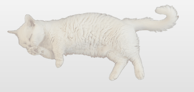
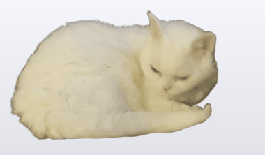
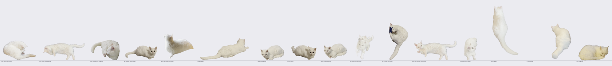

# 🐱 Desktop Cat — your real cat as a macOS desktop pet

**Turn videos of your actual cat into a photorealistic desktop pet.** A transparent,
click-through overlay (think *shimeji*, *neko*, or a screenmate — but it's genuinely YOUR cat)
that sleeps, grooms, plays, reacts to clicks and petting, and lives on a circadian rhythm.

<p align="center">
  
  
</p>

<p align="center"></p>

- 🪟 **Not a window** — a borderless transparent overlay; only the cat's silhouette is clickable, everything else clicks through
- 🎞️ **Made from your own videos** — local AI background removal (BiRefNet on Apple GPU), no cloud, no accounts
- 🧠 **Behavior brain** — needs (energy/hunger/playfulness/affection/cleanliness), softmax activity selection, sleeps more at night, grooms after waking
- 🖱️ **Interactions** — click = reaction, double-click = new scene, drag to carry, slow strokes to pet
- 📦 **Ships as a real .app** — self-contained bundle, drag to /Applications
- ⚡ **Featherweight** — <1% CPU, ~40–140 MB RAM, pure Python (PyObjC), no Xcode needed


## ⬇️ Download

**[Grab the ready-to-run app from Releases](https://github.com/andyy-yang/desktop-cat/releases/latest)** (macOS 13+, Apple Silicon) — includes the example cat. First launch needs right-click → Open (ad-hoc signed). To star in it with *your own* cat, follow the pipeline below.

## How it works

```
your pet videos
   → pick segments (pet fully in frame, no hands, one animal)
   → BiRefNet matting per frame (alpha-matted RGBA sprites)
   → Clip Packages (frames + manifest: fps, loop mode, category, ground anchor)
   → behavior brain (needs → softmax activity selection → per-activity state machines)
   → transparent NSPanel renderer (per-pixel click-through, drag, pet-by-stroking)
```

The window's interactive region is the animal's silhouette, sampled per-pixel from the current
frame's alpha. Clicks land on your pet; clicks beside it fall through to whatever's underneath.

## Quick start

```bash
python3 -m venv .venv                      # python.org framework build of Python 3.11+
.venv/bin/pip install -r requirements.txt

# 1. Make a clip from a video segment (a sleeping pet is the easiest first clip):
ffmpeg -ss 2 -t 8 -i my_pet.mov -vf fps=12 -y work/frames/%04d.png
.venv/bin/python -B pipeline/matte_clip.py --frames work/frames \
    --model birefnet_general --out clips/sleep_curl --name sleep_curl \
    --source-fps 12 --target-fps 12 --category sleep

# 2. Inspect the matte (always look before shipping a clip):
.venv/bin/python -B pipeline/qc_clip.py --clip clips/sleep_curl
.venv/bin/python -B pipeline/verify_matte.py --clip clips/sleep_curl

# 3. Index and run:
.venv/bin/python -B pipeline/build_index.py --clips clips
.venv/bin/python -B -m overlay.app.main --clips clips
```

Quit via the menu-bar item, which also has Pause and a 10–1000% size slider.
One clip is enough to start; the brain schedules whatever categories exist
(`sleep | idle | groom | play | walk | reaction`). See `USER_MANUAL.md` for interactions
and `CONTRACTS.md` for the module architecture.

## Content rules (learned the hard way)

- The animal must be **fully in frame with margin** for the entire segment — edge-cut paws or
  tails read as amputations on a desktop overlay.
- No hands, no second animal, no toys crossing the body (a wand toy touching the pet becomes
  part of the matte and cannot be separated).
- Dark, contrasting backgrounds matte dramatically better, especially for light-colored fur.
- Normalize scale across clips (`pipeline/normalize_scale.py`) so your pet stays one size, and
  recompute ground anchors (`pipeline/fix_anchors.py`).
- Automated QC catches structural failures; your eyes catch the rest. Look at every clip.

## Packaging a standalone .app

```bash
cd packaging && ../.venv/bin/python -B setup_app.py py2app
```

Produces a fully self-contained `OverlayCat.app` (embedded Python + your clips, ad-hoc signed,
~250 MB). Set `EXPECTED_CLIP_PACKAGES` in `setup_app.py` to your clip count — the build fails
loudly on mismatch by design.

## Tests

```bash
.venv/bin/python -B -m pytest tests/brain tests/app -q   # behavior brain + runtime geometry
.venv/bin/python -B -m tests.integration.verify_live --clips clips --out work/verify
```

`verify_live` drives a real window: it warps the cursor to verify per-pixel click-through and
captures the app's own window for visual checks — run it when you're not mid-typing.

## Notes

- macOS 13+; the display-sync and window APIs used here deliberately avoid anything newer.
- torch is pinned to 2.8.0 — newer versions drop Apple-GPU (MPS) support on macOS 13.
- No telemetry, no network calls at runtime; pet state lives in
  `~/Library/Application Support/OverlayCat/`.
